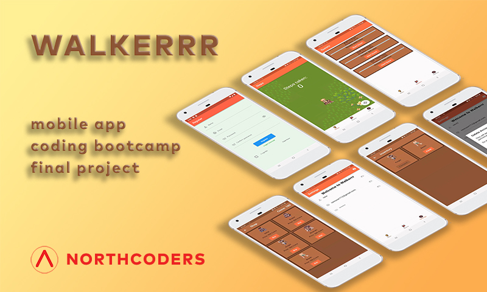

<!-- Improved compatibility of back to top link: See: https://github.com/othneildrew/Best-README-Template/pull/73 -->

<a name="readme-top"></a>

<!--
*** Thanks for checking out the Best-README-Template. If you have a suggestion
*** that would make this better, please fork the repo and create a pull request
*** or simply open an issue with the tag "enhancement".
*** Don't forget to give the project a star!
*** Thanks again! Now go create something AMAZING! :D
-->

<!-- PROJECT SHIELDS -->
<!--
*** I'm using markdown "reference style" links for readability.
*** Reference links are enclosed in brackets [ ] instead of parentheses ( ).
*** See the bottom of this document for the declaration of the reference variables
*** for contributors-url, forks-url, etc. This is an optional, concise syntax you may use.
*** https://www.markdownguide.org/basic-syntax/#reference-style-links
-->

[![Contributors][contributors-shield]][contributors-url]
[![Forks][forks-shield]][forks-url]
[![Stargazers][stars-shield]][stars-url]
[![Issues][issues-shield]][issues-url]
[![MIT License][license-shield]][license-url]
[![LinkedIn][linkedin-shield]][linkedin-url]

<!-- PROJECT LOGO -->
<br />
<div align="center">
  <a href="https://northcoders.com">
    
  </a>

<h1 align="center">WALKERRR</h1>

  <p align="center">
    Mobile app in Flutter, <a href="https://northcoders.com/our-courses/coding-bootcamp">Northcoders Software Developer Coding Bootcamp</a> final project.<br /> Finished January 2023.
    <br />
    <br />
    <a href="https://github.com/jackharbon/walkerrr-mobile-app">View Demo</a>
    ·
    <a href="https://github.com/jackharbon/walkerrr-mobile-app/issues">Report Bug</a>
    ·
    <a href="https://github.com/jackharbon/walkerrr-mobile-app/issues">Request Feature</a>
  </p>
</div>
<!-- TABLE OF CONTENTS -->
<details>
  <summary>Table of Contents</summary>
  <ol>
    <li>
      <a href="#about-the-project">About The Project</a>
      <ol>
        <li><a href="#project-team">Project team</a></li>
        <li><a href="#planning-process">Planning process</a></li>
        <li><a href="#app-description">App Description</a></li>
        <li><a href="#built-with">Built With</a></li>
      </ol>
    </li>
    <li>
      <a href="#getting-started">Getting Started</a>
      <ol>
        <li><a href="#prerequisites">Prerequisites</a></li>
        <li><a href="#installation">Installation</a></li>
      </ol>
    </li>
    <li><a href="#roadmap">Roadmap</a></li>
    <li><a href="#contributing">Contributing</a></li>
    <li><a href="#license">License</a></li>
    <li><a href="#contact">Contact</a></li>
    <li><a href="#acknowledgments">Acknowledgments</a></li>
  </ol>
</details>
<br />

<!-- ABOUT THE PROJECT -->

# About The Project



## Project team

Our team name was Merge Conflict with team members:

-  [David Holmes](https://github.com/DavidH3031)
-  [GJ Abordo](https://github.com/26june)
-  [Eddy King](https://github.com/EddySafc)
-  [Jak Harbon](https://github.com/jackharbon/)

## Planning process

We had 4 different ideas for the project app described by:

-  User stories
-  MVP
-  RATS
-  Spiking

[See FigJam board >](https://www.figma.com/file/IepeA19A72gyPp7fKbP0Ga/merge-conflict-plan?node-id=165%3A340&t=tBJIxTIG2vH7dUhY-1)

Finally, after spiking and testing different variants for the whole week, we've chosen Walkerrr with tech:

-  Firebase for authentication
-  MongoDB for back-end
-  Flutter/Dart for front-end
   (rejecting React Native and Expo, as they created some problems during spiking).

Our team worked remotely using:

-  work-in-pairs method (navigator and coder)
-  Slack Huddles for stand-up meetings and pairings
-  FigJam for planning
-  GitHub for version control
-  Trello board for organising tasks and tickets

### Team's retrospection video on Youtube

<a href="https://youtu.be/n_24fcZvzug">
    
  </a>

## App Description

### <u>Disclaimer</u>

`This app was created as a final Northcoders Software Developer Bootcamp team project. All Rights Reserved for Northcoders.`

Project app is called Wallkerrr. It is an app that makes walking more exciting by adding an rpg element to it.

User steps complete different quests which earn coins, these can then be used to buy armor for your base character.

Quests will be started by the user and have a time limit in which to complete them, quests with more steps will earn better prizes.

After login the user can:

-  navigate through the app (Steps, Quests, Settings)
-  vie the list of quests
-  overview of the achievements (steps today, coins, quest progress)
-  manage character
-  see and buy the shop items
-  see notifications about quests completion

### App presentation video on Youtube

<a href="https://youtu.be/wal_VPx8qZc">
    
  </a>

<p align="right">(<a href="#readme-top">back to top</a>)</p>

## Built With

| Coding                                           | Back-end                                  | Front-end                              |
| ------------------------------------------------ | ----------------------------------------- | -------------------------------------- |
| planning, version control, code editing          | database, authentication, environment     | framework and language                 |
| [![Figma][figma.com]][figma-url]                 | [![Mongodb][mongodb.com]][mongodb-url]    | [![Flutter][flutter.dev]][flutter-url] |
| [![GitHub][github.com]][github-url]              | [![Firebase][firebase.com]][firebase-url] | [![Dart][dart.dev]][dart-url]          |
| [![VSC][visualstudiocode]][visualstudiocode-url] | [![Node.js][nodejs.org]][nodejs-url]      |                                        |
| [![Slack][slack.com]][slack-url]                 |                                           |                                        |

<p align="right">(<a href="#readme-top">back to top</a>)</p>

<!-- GETTING STARTED -->

# Getting Started

Feel free to test the app for yourself (excluding commercial purposes) when the app is ready.

## Installation

### To host this project locally:

### 1. Clone the repo:

```
git clone https://github.com/jackharbon/walkerrr-mobile-app.git
```

### 2. Change folders:

```
 cd fit-2-ger-frontend
```

### 3. Run app:

connect your device or use an emulator and type in the command 'flutter run' in the terminal and wait for the app to install

-  install npm
   ```sh
   npm install npm@latest -g
   ```
-  run flutter
   ```sh
   flutter run
   ```
-  instructions on how to setup your android phone or an emulator can be found here:
   https://docs.flutter.dev/get-started/install

### 4. Back-end repo:

https://github.com/jackharbon/walkerrr-mobile-app/tree/main/fit-2-ger-backend

<!-- ROADMAP -->

# Roadmap

-  [ ] Firebase
-  [ ] MongoDB
-  [ ] Back-end
-  [ ] Testing
-  [ ] Flutter Scaffold
-  [ ] Login/register

See the [open issues](https://github.com/jackharbon/walkerrr-mobile-app/issues) for a full list of proposed features (and known issues).

<p align="right">(<a href="#readme-top">back to top</a>)</p>

<!-- LICENSE -->

# License

All rights belong to [Northcoders](http://northcoders.com). See <a href="https://github.com/jackharbon/walkerrr-mobile-app/blob/main/LICENSE">`LICENSE.txt` </a> for more information.

<p align="right">(<a href="#readme-top">back to top</a>)</p>

<!-- CONTACT -->

# Contact

Jacek Harbon - [@JacekHarbon](https://twitter.com/JacekHarbon) - jacek@harbon.uk

Project Link: [https://github.com/jackharbon/walkerrr-mobile-app](https://github.com/jackharbon/walkerrr-mobile-app)

<p align="right">(<a href="#readme-top">back to top</a>)</p>

<!-- ACKNOWLEDGMENTS -->

# 6. Acknowledgments

-  [Northcoders](https://northcoders.com)
-  [Firebase](https://firebase.google.com/docs/auth)
-  [Mongo DB](https://www.mongodb.com/)
-  [Cyclic](https://www.cyclic.sh/)
-  [Node.js](https://nodejs.org/en/)
-  [NPM.js](https://www.npmjs.com/)
-  [Fluter](https://flutter.dev/)
-  [Dart](https://dart.dev/guides/language/language-tour)
-  [Dart Pad](https://www.dartpad.dev/?)
-  [Visual Studio Code](https://code.visualstudio.com/)
-  [Android Studio](https://developer.android.com/studio)
-  [Material Design](https://m3.material.io/)
-  [Netlify](https://app.netlify.com/signup/start)

<p align="right">(<a href="#readme-top">back to top</a>)</p>

<!-- MARKDOWN LINKS & IMAGES -->
<!-- https://www.markdownguide.org/basic-syntax/#reference-style-links -->

[contributors-shield]: https://img.shields.io/github/contributors/jackharbon/walkerrr-mobile-app.svg?style=for-the-badge
[contributors-url]: https://github.com/jackharbon/walkerrr-mobile-app/graphs/contributors
[forks-shield]: https://img.shields.io/github/forks/jackharbon/walkerrr-mobile-app.svg?style=for-the-badge
[forks-url]: https://github.com/jackharbon/walkerrr-mobile-app/network/members
[stars-shield]: https://img.shields.io/github/stars/jackharbon/walkerrr-mobile-app.svg?style=for-the-badge
[stars-url]: https://github.com/jackharbon/walkerrr-mobile-app/stargazers
[issues-shield]: https://img.shields.io/github/issues/jackharbon/walkerrr-mobile-app.svg?style=for-the-badge
[issues-url]: https://github.com/jackharbon/walkerrr-mobile-app/issues
[license-shield]: https://img.shields.io/github/license/jackharbon/walkerrr-mobile-app.svg?style=for-the-badge
[license-url]: https://github.com/jackharbon/walkerrr-mobile-app/blob/master/LICENSE.txt
[linkedin-shield]: https://img.shields.io/badge/-LinkedIn-black.svg?style=for-the-badge&logo=linkedin&colorB=555
[linkedin-url]: https://www.linkedin.com/in/jgharbon/
[product-screenshot]: images/screenshot.png
[figma.com]: https://img.shields.io/badge/figma-e04a34?style=for-the-badge&logo=figma&logoColor=white
[figma-url]: https://figma.com/
[github.com]: https://img.shields.io/badge/GitHub-000000?style=for-the-badge&logo=github&logoColor=white
[github-url]: https://github.com/
[flutter.dev]: https://img.shields.io/badge/flutter-1A1744?style=for-the-badge&logo=flutter&logoColor=45C9FA
[flutter-url]: https://flutter.dev
[dart.dev]: https://img.shields.io/badge/dart-838383?style=for-the-badge&logo=dart&logoColor=055A9D
[dart-url]: https://dart.dev
[firebase.com]: https://img.shields.io/badge/firebase-039BE6?style=for-the-badge&logo=firebase&logoColor=FFA611
[firebase-url]: https://firebase.com/
[mongodb.com]: https://img.shields.io/badge/Mongodb-3F2C1B?style=for-the-badge&logo=mongodb&logoColor=62AC53
[mongodb-url]: https://mongodb.com/
[nodejs.org]: https://img.shields.io/badge/node.js-7EBB00?style=for-the-badge&logo=nodedotjs&logoColor=313429
[nodejs-url]: https://nodejs.org/
[visualstudiocode]: https://img.shields.io/badge/visualstudio-3CA4EA?style=for-the-badge&logo=visualstudio&logoColor=white
[visualstudiocode-url]: https://code.visualstudio.com
[slack.com]: https://img.shields.io/badge/slack-E5AC2B?style=for-the-badge&logo=slack&logoColor=D91C57
[slack-url]: https://slack.com
