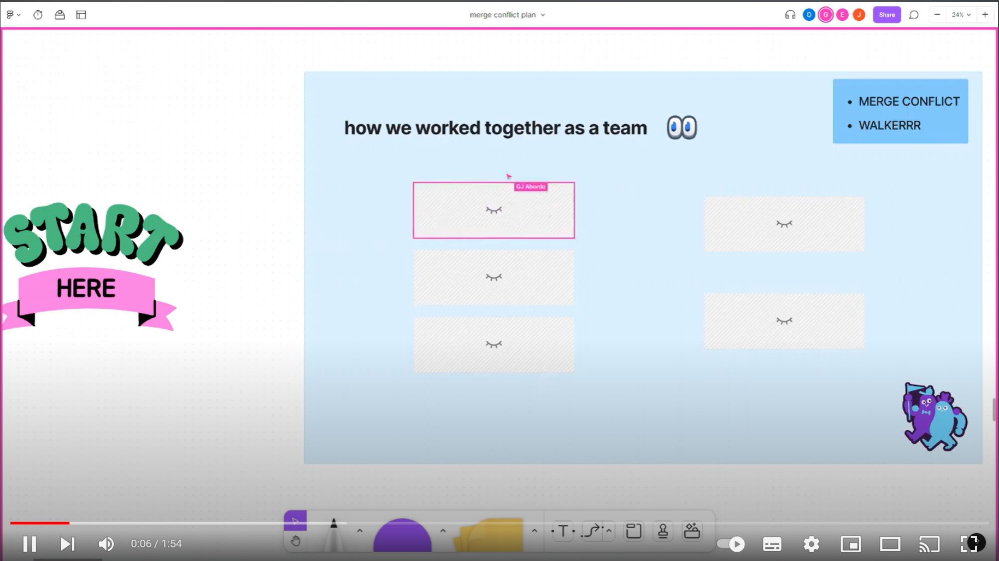

<!-- The project app is called Wallkerrr. It is an app that makes walking more exciting by adding an rpg element to it.-->

<a name="readme-top"></a>

<br />
<div align="center">

[![Contributors][contributors-shield]][contributors-url]
[![Forks][forks-shield]][forks-url]
[![Stargazers][stars-shield]][stars-url]
[![Issues][issues-shield]][issues-url]
[![MIT License][license-shield]][license-url]
[![LinkedIn][linkedin-shield]][linkedin-url]

<!-- PROJECT LOGO -->
<br />

  <a href="https://northcoders.com">
    
  </a>

<h1 align="center">WALKERRR</h1>

  <p align="center">
    Mobile app in Flutter, <a href="https://northcoders.com/our-courses/coding-bootcamp">Northcoders Software Developer Coding Bootcamp</a> final project.<br /> Finished January 2023.
    <br />
    <br />
    <a href="https://github.com/jackharbon/walkerrr-mobile-app">View Demo</a>
    ·
    <a href="https://github.com/jackharbon/walkerrr-mobile-app/issues">Report Bug</a>
    ·
    <a href="https://github.com/jackharbon/walkerrr-mobile-app/issues">Request Feature</a>
  </p>
</div>
<!-- TABLE OF CONTENTS -->
<details>
  <summary>Table of Contents</summary>
  <ul>
    <li>
      <a href="#about-the-project">About The Project</a>
      <ul>
        <li><a href="#project-team">Project team</a></li>
        <li><a href="#planning-process">Planning process</a></li>
        <li><a href="#app-description">App Description</a></li>
        <li><a href="#built-with">Built With</a></li>
      </ul>
    </li>
    <li>
      <a href="#getting-started">Getting Started</a>
      <ul>
        <li><a href="#prerequisites">Prerequisites</a></li>
        <li><a href="#installation">Installation</a></li>
      </ul>
    </li>
    <li><a href="#roadmap">Roadmap</a></li>
    <li><a href="#license">License</a></li>
    <li><a href="#contact">Contact</a></li>
    <li><a href="#acknowledgments">Acknowledgments</a></li>
  </ul>
</details>
<br />

<!-- ABOUT THE PROJECT -->

# About The Project


## Project team

Our team name was Merge Conflict with team members:

-  [David Holmes](https://github.com/DavidH3031)
-  [GJ Abordo](https://github.com/26june)
-  [Eddy King](https://github.com/EddySafc)
-  [Jack Harbon](https://github.com/jackharbon/)

<p align="right">(<a href="#readme-top">back to top</a>)</p>

## Planning process

We had 4 different ideas for the project app described by:

-  User stories
-  MVP
-  RATS
-  Spiking

[See FigJam board >](https://www.figma.com/file/IepeA19A72gyPp7fKbP0Ga/merge-conflict-plan?node-id=165%3A340&t=tBJIxTIG2vH7dUhY-1)

Finally, after spiking and testing different variants for the whole week, we chose Walkerrr with tech:

-  Firebase for authentication
-  MongoDB for back-end
-  Flutter/Dart for front-end
   (rejecting React Native and Expo, as they created some problems during spiking).

Our team worked remotely using:

-  work-in-pairs method (navigator and coder)
-  Slack Huddles for stand-up meetings and pairings
-  FigJam for planning
-  GitHub for version control
-  Trello board for organising tasks and tickets

### Team's retrospection video on Youtube and on [metroretro](https://metroretro.io/BO354V8Y6SQ7)

<a href="https://youtu.be/n_24fcZvzug">
    
  </a>

<p align="right">(<a href="#readme-top">back to top</a>)</p>

## App Description

### <u>Disclaimer</u>

`This app was created as a final Northcoders Software Developer Bootcamp team project. All Rights Reserved for Northcoders.`

The project app is called Wallkerrr. It is an app that makes walking more exciting by adding an rpg element to it.

The user makes steps to complete different quests which earn coins, these can then be used to buy armour for your base character.

Quests will be started by the user and have a time limit in which to complete them, quests with more steps will earn better prizes.

After login the user can:

-  navigate through the app (Steps, Quests, Settings)
-  view the list of quests
-  get an overview of the achievements (steps today, coins, quest progress)
-  manage their character
-  see and buy the shop items
-  see notifications about quests completion

### App presentation video on Youtube

<a href="https://youtu.be/wal_VPx8qZc">
    
  </a>

<p align="right">(<a href="#readme-top">back to top</a>)</p>

## Built With

| Coding                                           | Back-end                                  | Front-end                              |
| ------------------------------------------------ | ----------------------------------------- | -------------------------------------- |
| planning, version control, code editing          | database, authentication, environment     | framework and language                 |
| [![Figma][figma.com]][figma-url]                 | [![Mongodb][mongodb.com]][mongodb-url]    | [![Flutter][flutter.dev]][flutter-url] |
| [![GitHub][github.com]][github-url]              | [![Mongoose][mongoose.com]][mongoose-url] | [![Dart][dart.dev]][dart-url]          |
| [![VSC][visualstudiocode]][visualstudiocode-url] | [![Firebase][firebase.com]][firebase-url] |                                        |
| [![Slack][slack.com]][slack-url]                 | [![Node.js][nodejs.org]][nodejs-url]      |                                        |

<p align="right">(<a href="#readme-top">back to top</a>)</p>

<!-- GETTING STARTED -->

# Getting Started

Feel free to test the app for yourself (excluding commercial purposes, all rights belong to [Northcoders](https://northcoders.com/)).

## Prerequisites

To run the app you need a few pieces of software. The installation process will depend on your computer operating system (Linux, Mac OS, MS Windows), so I have included general instructions, for more detailed steps you need to read the software provider's instructions (docs) for the specific system. And also I DO NOT recommend using [WSL](https://learn.microsoft.com/en-us/windows/wsl/about) (Windows Subsystem for Linux), because of the problems with Android emulation, as WSL does not support GUI applications and SDK for Windows do not work with WSL.

Install useful software:

-  JavaScript runtime environment [Node.js](https://nodejs.org/en/)
-  Source code editor like [Visual Studio Code](https://code.visualstudio.com/Download)
-  Android SDK with emulator [Android Studio](https://developer.android.com/studio#downloads)
-  You may want to install desktop verion of [GitHub](https://desktop.github.com/)

<p align="right">(<a href="#readme-top">back to top</a>)</p>

## Installation

### I. Host this project locally

1. Register your account on GitHub, read this [Docs](https://docs.github.com/en/get-started/quickstart/set-up-git) for settting up Git.
2. Use "Fork" button in the top right corner of this page to copy this repository to your account.
3. You can leave the repository name as it is, click the green button "Create fork".
4. Open a modal window by clicking the green button "<> Code" and copy the link to your fork which looks like this: `https://github.com/your_github_name/walkerrr-mobile-app.git`
5. Open your Terminal (for Windows read [this](https://github.com/microsoft/terminal) and [this](https://learn.microsoft.com/en-us/windows/terminal/)) and navigate `cd /path/to/folder` to your projects folder.

-  Check Node.js installation
   ```sh
   node -v
   ```
-  Ceck NPM installation
   ```sh
   npm -v
   ```
-  Clone repository to your computer (change `your_github_name` to your actual GitHub login)
   ```sh
   git clone https://github.com/your_github_name/walkerrr-mobile-app.git
   ```
-  Navigate to repo folder
   ```sh
   cd walkerrr-mobile-app
   ```
-  Open Visual Studio Code

   ```sh
   code .
   ```

   Open Visual Studio Code terminal (`Ctr + '`)

### II. Set up back-end (<i>skip to `III. Set up front-end` if you don't want to modify database schema</i>)

1. Preparations

-  Navigate to back-end directory
   ```sh
   cd walkerrr-backend
   ```
-  Update npm and install dependencies
   ```sh
   npm install npm@latest -g
   ```
   ```sh
   sudo npm i --save
   ```
   ```sh
   npm fund
   ```
   ```sh
   npm init -y
   ```

2. Database connection

   If you need help with those steps, watch YouTube tutorial [How to Connect Node.js App to MongoDB | Node.js & MongoDB Tutorial](https://youtu.be/bhiEJW5poHU) or read [MongoDB docs](https://www.mongodb.com/docs/drivers/node/current/quick-start/).

-  Go to [MongoDB](https://www.mongodb.com/cloud/atlas/register) page and register account (you can sign up with Google).
-  Create new cluster (database).<br />
   Goal: "Build a new application".<br />
   Type of application: f.e. "Web Application".<br />
   Preferred language: "JavaScript".<br />
   Click "Finish"
-  Click "Create" button for free shared database.<br />
   Give a name "walkerrr" and create cluster.
-  Create a database user with username "walkerrr" and password (remember the password). Click "Create user" button and "Add My Current IP Adress" and "Finish and Close" below.
-  Click "Connect" -> "Connect your application" button.
-  Copy your connection string, the link, which looks like this:
   ```sh
   mongodb+srv://walkerrr:<password>@walkerrr.vvwslic.mongodb.net/?retryWrites=true&w=majority
   ```
   Replace `<password>` with your password you entered on MongoDB website.
-  Open the file `.env-example`, save it as `.env` and paste the above link (with the proper password).
   ```sh
   DATABASE_URL=mongodb+srv://walkerrr:<PASSWORD>@walkerrr.vvwslic.mongodb.net/?retryWrites=true&w=majority
   ```
-  Open Visual Studio Code terminal (check if you are in `walkerrr-backend` folder), type
   ```sh
   npm start
   ```
-  If everything went fine you will get confirmation messages
   ```sh
   Listening on port 9095...
   ```
   ```sh
   Remote MongoDB connected...
   ```

3. Deploy back-end

-  Go to the [Cyclic](https://www.cyclic.sh/) website and sign up with your GitHub account.
-  Add your GitHub repo, edit root and output path
   ```sh
   /walkerrr-backend
   ```

### III. Set up front-end

1. Preparations

-  Install [Flutter](https://docs.flutter.dev/get-started/install) on your computer
-  Install Flutter extension from the [Visual Studio Code Marketplace](https://marketplace.visualstudio.com/items?itemName=Dart-Code.flutter) or by searching within VS Code. The Dart extension will be installed automatically, if not already installed.
-  Open terminal (`Ctr + '`) in Visual Studio Code and navigate to the front-end directory

   ```sh
   cd walkerrr-frontend
   ```

2. Emulating the app

-  [Connect your mobile phone using USB](https://learn.microsoft.com/en-us/microsoft-edge/devtools-guide-chromium/remote-debugging/) cable or [use an emulator](https://www.geeksforgeeks.org/how-to-run-a-flutter-app-on-android-emulator/) and type in the commands in the terminal

-  Edit a file [api_connection.dart](walkerrr-frontend\lib\services\api_connection.dart) and replace URL endpoint with your link in the line 5<br />
   `const baseAPI =`
   ```sh
   'https://walkerrr-backend.cyclic.app`;
   ```
-  Navigate to front-end directory
   ```sh
   cd walkerrr-frontend
   ```
-  Install updates
   ```sh
   flutter pub get
   ```
   ```sh
   flutter upgrade
   ```
-  Check Flutter installation
   ```sh
   flutter doctor
   ```
-  You can additionally check connected devices
   ```sh
   flutter devices
   ```
-  Run Flutter and wait for the app to install
   ```sh
   flutter run
   ```
   Read [how to use emulator in Visual Studio Code](https://dev.to/dailydevtips1/running-a-flutter-app-on-ios-and-android-emulators-3h33).

<p align="right">(<a href="#readme-top">back to top</a>)</p>

<!-- ROADMAP -->

# Roadmap

-  [x] Login/register page
-  [x] Settings - user profile
-  [x] Quests
-  [x] Steps
-  [x] Inventory
-  [ ] Customisation
-  [ ] Stats reseting
-  [ ] Notifications

<p align="right">(<a href="#readme-top">back to top</a>)</p>

<!-- LICENSE -->

# License

All rights belong to [Northcoders](http://northcoders.com). See <a href="https://github.com/jackharbon/walkerrr-mobile-app/blob/main/LICENSE">`LICENSE.txt` </a> for more information.

<p align="right">(<a href="#readme-top">back to top</a>)</p>

<!-- CONTACT -->

# Contact

Jacek Harbon - [@JacekHarbon](https://twitter.com/JacekHarbon) - jacek@harbon.uk

Project Link: [https://github.com/jackharbon/walkerrr-mobile-app](https://github.com/jackharbon/walkerrr-mobile-app)

<p align="right">(<a href="#readme-top">back to top</a>)</p>

<!-- ACKNOWLEDGMENTS -->

# Acknowledgments

-  [Northcoders](https://northcoders.com)
-  [Firebase](https://firebase.google.com/docs/auth)
-  [Mongo DB](https://www.mongodb.com/docs/drivers/node/current/)
-  [Mongoose](https://mongoosejs.com/docs/index.html)
-  [Cyclic](https://www.cyclic.sh/)
-  [Node.js](https://nodejs.org/en/)
-  [NPM.js](https://www.npmjs.com/)
-  [Fluter](https://flutter.dev/)
-  [Dart](https://dart.dev/guides/language/language-tour)
-  [Dart Pad](https://www.dartpad.dev/?)
-  [Visual Studio Code](https://code.visualstudio.com/)
-  [Android Studio](https://developer.android.com/studio)
-  [Material Design](https://m3.material.io/)
-  [Netlify](https://app.netlify.com/signup/start)
-  [Render](https://render.com/)

<p align="right">(<a href="#readme-top">back to top</a>)</p>

<!-- MARKDOWN LINKS & IMAGES -->
<!-- https://www.markdownguide.org/basic-syntax/#reference-style-links -->

[contributors-shield]: https://img.shields.io/github/contributors/jackharbon/walkerrr-mobile-app.svg?style=for-the-badge
[contributors-url]: https://github.com/jackharbon/walkerrr-mobile-app/graphs/contributors
[forks-shield]: https://img.shields.io/github/forks/jackharbon/walkerrr-mobile-app.svg?style=for-the-badge
[forks-url]: https://github.com/jackharbon/walkerrr-mobile-app/network/members
[stars-shield]: https://img.shields.io/github/stars/jackharbon/walkerrr-mobile-app.svg?style=for-the-badge
[stars-url]: https://github.com/jackharbon/walkerrr-mobile-app/stargazers
[issues-shield]: https://img.shields.io/github/issues/jackharbon/walkerrr-mobile-app.svg?style=for-the-badge
[issues-url]: https://github.com/jackharbon/walkerrr-mobile-app/issues
[license-shield]: https://img.shields.io/github/license/jackharbon/walkerrr-mobile-app.svg?style=for-the-badge
[license-url]: https://github.com/jackharbon/walkerrr-mobile-app/blob/master/LICENSE.txt
[linkedin-shield]: https://img.shields.io/badge/-LinkedIn-black.svg?style=for-the-badge&logo=linkedin&colorB=555
[linkedin-url]: https://www.linkedin.com/in/jgharbon/
[product-screenshot]: images/screenshot.png
[figma.com]: https://img.shields.io/badge/figma-e04a34?style=for-the-badge&logo=figma&logoColor=white
[figma-url]: https://figma.com/
[github.com]: https://img.shields.io/badge/GitHub-000000?style=for-the-badge&logo=github&logoColor=white
[github-url]: https://github.com/
[flutter.dev]: https://img.shields.io/badge/flutter-1A1744?style=for-the-badge&logo=flutter&logoColor=45C9FA
[flutter-url]: https://flutter.dev
[dart.dev]: https://img.shields.io/badge/dart-838383?style=for-the-badge&logo=dart&logoColor=055A9D
[dart-url]: https://dart.dev
[firebase.com]: https://img.shields.io/badge/firebase-039BE6?style=for-the-badge&logo=firebase&logoColor=FFA611
[firebase-url]: https://firebase.com/
[mongodb.com]: https://img.shields.io/badge/Mongodb-3F2C1B?style=for-the-badge&logo=mongodb&logoColor=62AC53
[mongodb-url]: https://mongodb.com/
[mongoose.com]: https://img.shields.io/badge/mongoose-880000?style=for-the-badge&logo=mongoose&logoColor=white
[mongoose-url]: https://mongoose.com/
[nodejs.org]: https://img.shields.io/badge/node.js-7EBB00?style=for-the-badge&logo=nodedotjs&logoColor=313429
[nodejs-url]: https://nodejs.org/
[visualstudiocode]: https://img.shields.io/badge/visualstudio-3CA4EA?style=for-the-badge&logo=visualstudio&logoColor=white
[visualstudiocode-url]: https://code.visualstudio.com
[slack.com]: https://img.shields.io/badge/slack-E5AC2B?style=for-the-badge&logo=slack&logoColor=D91C57
[slack-url]: https://slack.com
